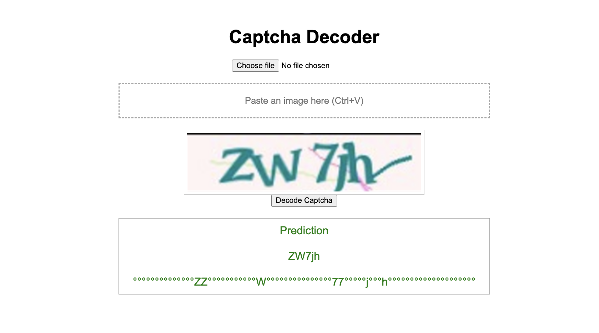

## Datasets
https://www.kaggle.com/datasets/parsasam/captcha-dataset (Gregwar Captcha)
https://www.kaggle.com/datasets/fournierp/captcha-version-2-images
<!-- - temp_1 - Basic Captcha on smaller dataset
- temp_2 - Deep Captcha on smaller dataset
- temp_3 - Deep Captcha with smaller time steps on smaller dataset
- temp 4 - Deep Captcha with smaller time steps v2 on smaller dataset
- temp 5 - tried Deep Captcha again - no results (overfitting)
- temp 6 -->
## Training the Model
Configure <code>src/config.py</code>
run <code>python3 src/train.py</code>

## Predict Captcha
Put images that are to be predicted in <code>test_images/</code>
run <code>src/predict.py</code>

## Run the Website
Start the backend server : <code>uvicorn website.backend.main:app --reload --port 8080</code>
Run the frontend : <code> cd website/frontend</code> <code>python3 -m http.server 8000</code>

## Model
The <code>DeepCaptchaModel</code> is a neural network designed for image-to-sequence tasks like CAPTCHA recognition. It begins with three convolutional layers interleaved with batch normalization and ReLU activations to extract spatial features while progressively reducing the input dimensions. The output of the final convolutional block is reshaped into a sequence along the image width, flattening the channel and height dimensions. A linear layer followed by dropout maps these features into a lower-dimensional space, which is then passed through a two-layer bidirectional GRU to capture temporal dependencies in both directions. The model concludes with a fully connected layer that outputs class probabilities for each time step, with an additional class for the CTC blank token. During training, it uses the CTC (Connectionist Temporal Classification) loss, allowing it to learn sequence alignments without requiring pre-segmented labels.
